# DiscussHub — Интернет-форум

# Содержание
- [1. Разработка и анализ требований](#1-разработка-и-анализ-требований)
  - [1.1. Анализ проблемы, цель разработки](#11-анализ-проблемы-цель-разработки)
    - [1.1.1. Проблема](#111-проблема)
    - [1.1.2. Актуальность](#112-актуальность)
    - [1.1.3. Цель разработки](#113-цель-разработки)
  - [1.2. Основные бизнес-процессы и бизнес-правила](#12-основные-бизнес-процессы-и-бизнес-правила)
  - [1.3. Границы системы](#13-границы-системы)
  - [1.4. Варианты использования](#14-варианты-использования)
  - [1.5. Спецификация требований](#15-спецификация-требований)
  - [1.6. Концептуальная модель предметной области](#16-концептуальная-модель-предметной-области)
- [2. Проектирование](#2-проектирование)
  - [2.1. Вид приложения](#21-вид-приложения)
  - [2.2. Архитектура системы](#22-архитектура-системы)
    - [2.2.1. Развертывание системы](#221-развертывание-системы)
    - [2.2.2. Структура серверной части](#222-структура-серверной-части)
    - [2.2.3. Структура клиентской части](#223-структура-клиентской-части)
  - [2.3. Компоненты системы и их взаимодействие](#23-компоненты-системы-и-их-взаимодействие)
  - [2.4. Информационное обеспечение](#24-информационное-обеспечение)
  - [2.5. Проект пользовательского интерфейса](#25-проект-пользовательского-интерфейса)
  - [2.6. Архитектурный шаблон](#26-архитектурный-шаблон)
  - [2.7. Техническое обеспечение](#27-техническое-обеспечение)
- [3. Конструирование](#3-конструирование)
  - [3.1. Обоснование выбора языка реализации и среды программирования](#31-обоснование-выбора-языка-реализации-и-среды-программирования)
  - [3.2. Организация файлового хранилища для исходных кодов, исполняемых файлов, внешних компонентов, наборов данных](#32-организация-файлового-хранилища-для-исходных-кодов-исполняемых-файлов-внешних-компонентов-наборов-данных)
  - [3.3. Выбор стиля кодирования](#33-выбор-стиля-кодирования)
  - [3.4. Способы поддержки версий файлов и сборок в процессе разработки](#34-способы-поддержки-версий-файлов-и-сборок-в-процессе-разработки)
  - [3.5. Описание способа включения в проект новых программистов при его последующем развитии или коммерциализации](#35-описание-способа-включения-в-проект-новых-программистов-при-его-последующем-развитии-или-коммерциализации)
- [4. Тестирование и отладка](#4-тестирование-и-отладка)
  - [4.1. Модульное тестирование](#41-модульное-тестирование)
  - [4.2. Функциональное тестирование](#42-функциональное-тестирование)
  - [4.3. Тестирование пользовательского интерфейса](#43-тестирование-пользовательского-интерфейса)
- [5. Ввод в эксплуатацию](#5-ввод-в-эксплуатацию)
  - [5.1. Развертывание](#51-развертывание)
  - [5.2. Руководство пользователя](#52-руководство-пользователя)
    - [5.2.1. Основное](#521-основное)
    - [5.2.2. Регистрация](#522-регистрация)
    - [5.2.3. Вход](#523-вход)
    - [5.2.4. Выход](#524-выход)
    - [5.2.5. Изменение данных аккаунта (почты или пароля)](#525-изменение-данных-аккаунта-почты-или-пароля)
    - [5.2.6. Треды](#526-треды)
    - [5.2.7. Посты](#527-посты)
    - [5.2.8. Оценка тредов](#528-оценка-тредов)
    - [5.2.9. Поиск по тредам](#529-поиск-по-тредам)
    - [5.2.10. Функции, доступные модератору](#5210-функции-доступные-модератору)
    - [5.2.11. Функции, доступные администратору](#5211-функции-доступные-администратору)
- [Заключение](#заключение)
- [Список использованной литературы](#список-использованной-литературы)

# Введение

В современном информационном пространстве социальные сети, блоги и онлайн-коммуникации играют ключевую роль в обмене мнениями, идеями и знаниями. В этом контексте форумы остаются одним из наиболее востребованных и популярных средств общения в интернете. С их помощью пользователи могут обсуждать различные темы, делиться опытом, задавать вопросы и получать советы от других участников. Однако существующие веб-платформы для форумов часто страдают от ограниченного функционала, неудобного интерфейса или недостаточной безопасности данных.

В данном контексте целью данной дипломной работы является разработка веб-приложения, специализированного на организации форумов, которое предложит современные и эффективные решения для пользователей. Форумы представляют собой тематические разделы сайта, который также называется форумом. Главной задачей будет создание интуитивно понятного, функционального и безопасного веб-интерфейса, который позволит пользователям легко обмениваться информацией, создавать и модерировать темы и следить за актуальными обсуждениями.

Для достижения поставленной цели необходимо выбрать технологии и инструменты разработки, выполнить проектирование архитектуры системы, разработать функционал и провести тестирование приложения.

В итоге разработка данного веб-приложения для организации форумов будет способствовать созданию удобного инструмента для общения и обмена информацией в онлайн-сообществах, повышая качество интернет-диалога и улучшая пользовательский опыт.

# 1. Разработка и анализ требований

## 1.1. Анализ проблемы, цель разработки

### 1.1.1. Проблема

Существует множество форумов в интернете, но не все из них и не всегда предоставляют положительный пользовательский опыт. Некоторые из них имеют ограниченные функциональные возможности, другие могут быть запутанными в использовании или недостаточно модернизированными. Более того, с ростом объема информации в интернете становится сложнее отслеживать и находить актуальные обсуждения и темы на форумах. Это создает необходимость в разработке современного и удобного веб-приложения, специализированного на общении между людьми.

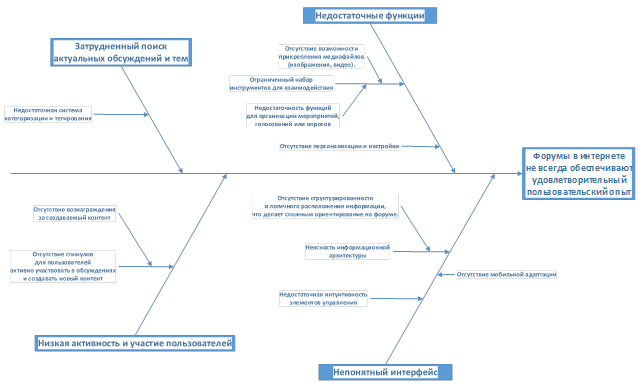

Рисунок 1 – Диаграмма Исикавы для проблемы (Fish Bone)

### 1.1.2. Актуальность

Актуальность данного проекта подтверждается рядом факторов:

**Постоянный рост интернет-пользователей:** С каждым годом количество пользователей интернета растет, что создает больший спрос на качественные онлайн-сервисы, включая форумы.

**Потребность в информации и общении:** Форумы остаются одним из основных источников информации и общения в интернете. С развитием социальных сетей и мессенджеров потребность в таких платформах не исчезает, а, наоборот, возрастает.

**Необходимость в современных решениях:** Существующие форумы могут быть устаревшими или неудобными в использовании. Пользователи ищут более современные и удобные альтернативы.

Таким образом, разработка веб-приложения для организации форумов является актуальной и востребованной задачей, которая обеспечит пользователей качественной и удобной платформой для обмена информацией и общения в онлайн-среде.

### 1.1.3. Цель разработки

Целью проекта является создание веб-приложения, которое предоставит пользователям простой, удобный и современный интерфейс для организации и участия в обсуждениях. Разработкой движет стремление разработать платформу, которая будет способствовать легкому взаимодействию пользователей, обмену информацией и обсуждению вопросов

## 1.2. Основные бизнес-процессы и бизнес-правила

Для разработки данной системы следует ознакомиться с ее бизнес-процессами. Для этого на рисунке 2 изображена концептуальная модель процесса работы желаемого форума.

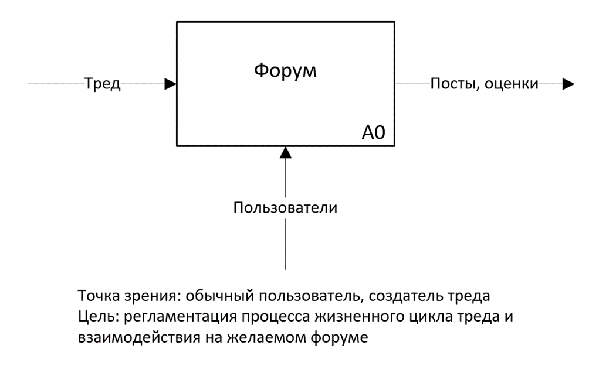

Рисунок 2 – Концептуальная диаграмма IDEF0

На данной диаграмме видно, что желаемый форум принимает контент, и пользователи реагируют на него. Этот процесс уточнен на рисунке 3 с помощью диаграммы декомпозиции.

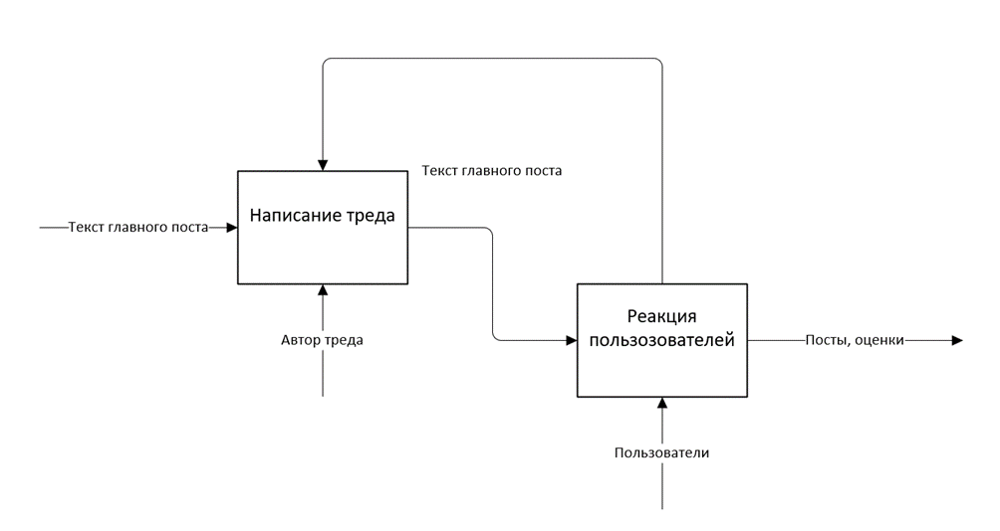

Рисунок 3 – Диаграмма декомпозиции IDEF0

После декомпозиции выделяется функционал по распространению контента до пользователей. Обычно это реализуется поиском, возможно еще другими методами.

## 1.3. Границы системы

Для описания границ системы использована диаграмма потоков данных, показанная на рисунке 4.

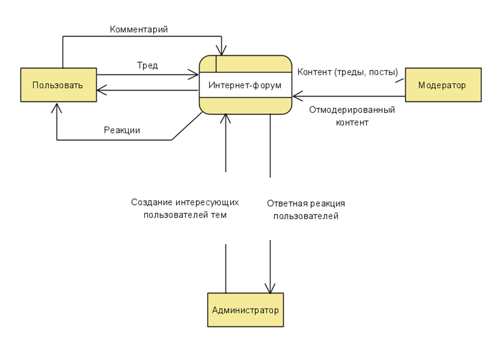

Рисунок 4 – Диаграмма потоков данных (DFD) - модель окружения

На данной диаграмме видно, что внешними к системе являются только люди — это пользователи, модераторы и администраторы.

## 1.4. Варианты использования

В плане вариантов использования, Администраторы — это те, кто производит управляет всем форумом: управляет списками тем. Модераторы - те, кто модерирует контент, создаваемый пользователями, и они также могут создавать контент. Обычные пользователи — это люди, которые зарегистрировались на форуме. Эти роли (то есть Пользователи) имеют аккаунты.

На рисунке 5 изображена диаграмма вариантов использования.

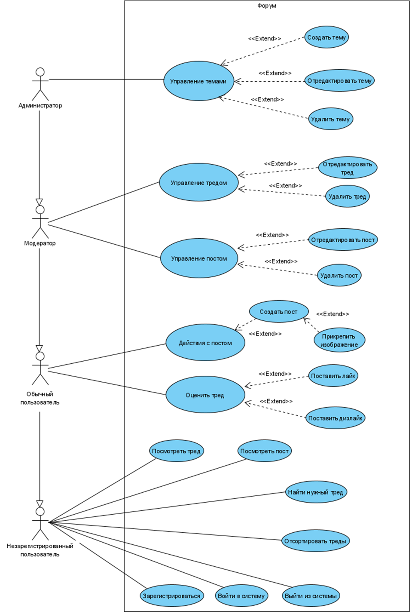

Рисунок 5 – Диаграмма вариантов использования (Use Case)

1. Назначение документа

1.1. Настоящий документ представляет спецификацию требований для веб-приложения для организации форумов

Описывает:
-	требования к функционалу, эксплуатационным характеристикам, интерфейсам взаимодействия с другими системами, оборудованию;
-	соответствие требований к ПО требованиям к продукту в целом.
-	SRS служит основой для дальнейшего планирования, дизайна и кодирования.

2. Общее описание

Данный продукт является веб-приложением для организации форумов, ориентированной на широкую аудиторию.

2.1. Общий взгляд на продукт

Цель создания документа состоит в сборе, анализе и выявлении высокоуровневых бизнес-требований, установлении возможностей для разработки веб-приложения для организации форумов и составлении необходимой документации.

Документ акцентирует внимание на необходимых для заинтересованных лиц и целевых пользователей возможностях, на том, почему эти потребности существуют. Подробности выполнения этих потребностей детализированы в спецификациях вариантов использования и спецификации требований.

2.2. Классы и характеристики пользователей

## 1.5. Спецификация требований

Таблица 2 – Классы и характеристики пользователей

|Класс|Описание|
|-|-|
|Незарегистрированный пользователь|Человек, который зашел на сайт и просматривает контент, не авторизуясь.|
|Зарегистрированный пользователь|Человек, который зарегистрировался на сайте и теперь может помимо просмотра контента создавать свой.|
|Модератор|Человек, который ответственен за модерацию контента|
|Администратор|Главное лицо сайта. Может создавать категории и управлять форумом в широком диапазоне.|
|Версия|v1.0|

2.2. Операционная среда

Веб-приложение должно осуществлять работу в любом мобильном и стационарном устройстве с доступом в сеть интернет через среду браузера.

3. Функции системы

3.1. Аутентификация
   
3.1.1. Описание

Пользователь может зарегистрироваться и войти в систему.
 
3.1.2. Функциональные требования

Таблица 3 – Регистрация

|Идентификатор требования|SRS-AUTH-001|
|-|-|
|Название|Регистрация|
|Описание|Неавторизованный пользователь может создать новый аккаунт, введя логин, имя, электронную почту и пароль. Логин и электронная почта должны быть уникальными во всей системе.|
|Источник|-|
|Версия|v1.0|

Таблица 4 – Вход в систему

|Идентификатор требования|SRS-AUTH-002|
|-|-|
|Название|Вход в систему|
|Описание|Неавторизованный пользователь может войти в систему с помощью ранее созданного аккаунта, введя логин или почту и пароль.|
|Источник|-|
|Версия|v1.0|

3.2. Управление аккаунтом

3.2.1. Описание

Авторизованный пользователь может редактировать данные своего аккаунта.

3.2.2. Функциональные требования

Таблица 5 – Обновление данных аккаунта

|Идентификатор требования|SRS-USERACC-001|
|-|-|
|Название|Обновление данных аккаунта|
|Описание|Пользователь может изменить свои данные своего аккаунта (электронная почта, пароль)|
|Источник|-|
|Версия|v1.0|

3.4. Взаимодействие с контентом

3.4.1. Описание

Простое взаимодействие с контентом, для которого не нужна регистрация.

3.4.2. Функциональные требования

Таблица 6 – Просмотр списка тем

|Идентификатор требования|SRS-UNREGUSER-001|
|-|-|
|Название|Просмотр списка тем|
|Описание|Пользователь может просмотреть список тем на форуме|
|Источник|-|
|Версия|v1.0|

Таблица 7 – Просмотр списка тредов в теме

|Идентификатор требования|SRS-UNREGUSER-002|
|-|-|
|Название|Просмотр списка тредов в теме|
|Описание|Пользователь может просмотреть список тредов в теме|
|Источник|-|
|Версия|v1.0|

Таблица 8 – Просмотр постов в треде

|Идентификатор требования|SRS-UNREGUSER-003|
|-|-|
|Название|Просмотр постов в треде|
|Описание|Пользователь может просмотреть посты в треде|
|Источник|-|
|Версия|v1.0|

Таблица 9 – Поиск тредов в теме

|Идентификатор требования|SRS-UNREGUSER-004|
|-|-|
|Название|Поиск тредов в теме|
|Описание|Пользователь может искать нужный ему тред с помощью фразы, введенную в форму поиска|
|Источник|-|
|Версия|v1.0|

Таблица 10 – Сортировка тредов в теме

|Идентификатор требования|SRS-UNREGUSER-005|
|-|-|
|Название|Сортировка тредов в теме|
|Описание|Пользователь может отсортировать треды по новизне, по дате последнего поста в треда, по рейтингу|
|Источник|-|
|Версия|v1.0|

3.5. Продвинутое взаимодействие с контентом

3.5.1. Описание

Продвинутое взаимодействие с контентом, для которого нужна регистрация.
 
3.5.2. Функциональные требования

Таблица 11 – Создание треда

|Идентификатор требования|SRS-REGUSER-001|
|-|-|
|Название|Создание треда|
|Описание|Зарегистрированный пользователь может создать тред|
|Источник|-|
|Версия|v1.0|

Таблица 12 – Оценка треда

|Идентификатор требования|SRS-REGUSER-002|
|-|-|
|Название|Оценка треда|
|Описание|Зарегистрированный пользователь может поставить треду лайк или дизлайк|
|Источник|-|
|Версия|v1.0|

Таблица 13 – Написание поста

|Идентификатор требования|SRS-REGUSER-003|
|-|-|
|Название|Написание поста|
|Описание|Зарегистрированный пользователь может написать пост|
|Источник|-|
|Версия|v1.0|

Таблица 14 – Редактирование поста

|Идентификатор требования|SRS-REGUSER-004|
|-|-|
|Название|Редактирование поста|
|Описание|Зарегистрированный пользователь может отредактировать свой пост|
|Источник|-|
|Версия|v1.0|

3.6. Модерирование контента

3.6.1. Описание

Взаимодействие с системой касательно контента, характерное для модератора

3.6.2. Функциональные требования

Таблица 15 – Удаление чужого поста

|Идентификатор требования|SRS-MODERATOR-001|
|-|-|
|Название|Удаление чужого поста|
|Описание|Модератор может удалить любой пост кроме постов модераторов и администраторов.|
|Источник|-|
|Версия|v1.0|

Таблица 16 – Удаление треда

|Идентификатор требования|SRS-MODERATOR-002|
|-|-|
|Название|Удаление треда|
|Описание|Модератор может удалить любой тред кроме тредов, созданных модераторами и администраторами.|
|Источник|-|
|Версия|v1.0|

Таблица 17 – Создание темы

|Идентификатор требования|SRS-ADMIN-003|
|-|-|
|Название|Создание темы|
|Описание|Администратор может создать тему.|
|Источник|-|
|Версия|v1.0|

Таблица 18 – Удаление темы

|Идентификатор требования|SRS-ADMIN-004|
|-|-|
|Название|Удаление темы|
|Описание|Администратор может удалить тему.|
|Источник|-|
|Версия|v1.0|

## 1.6. Концептуальная модель предметной области

На рисунке 6 изображена концептуальная модель предметной области.

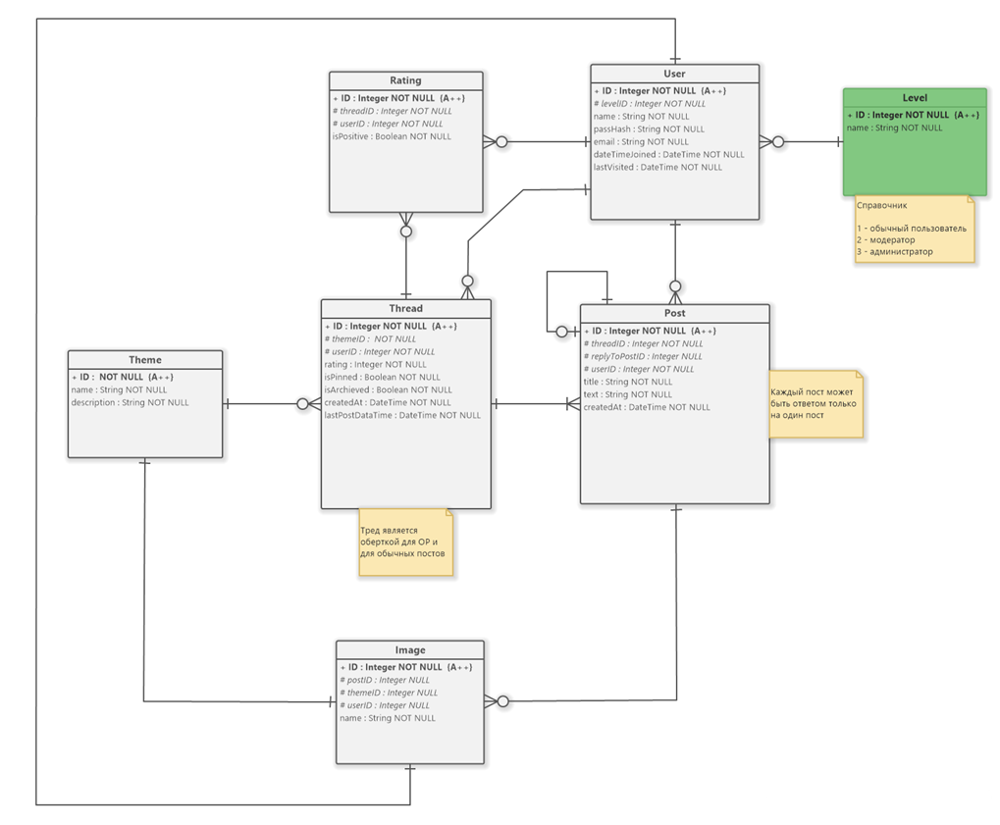

Рисунок 6 – Диаграмма классов уровня анализа UML

# 2. Проектирование

## 2.1. Вид приложения

Система представляет собой веб-приложение, исполняемое в любом современном браузере.

## 2.2. Архитектура системы

### 2.2.1. Развертывание системы

Система “Веб-приложение для организации форумов” должна быть развернута на сервере. Сервер содержит в себе базу данных, веб-сервер, WebAPI, приложение React.

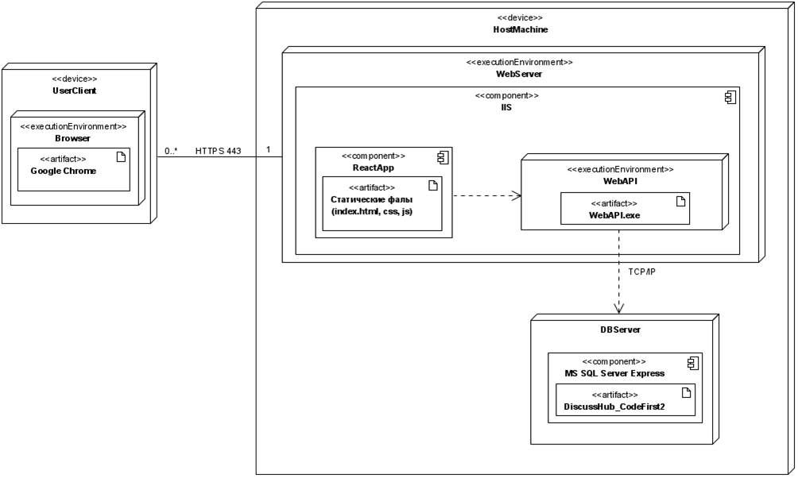

Рисунок 7 – Диаграмма развертывания

### 2.2.2. Структура серверной части

**Веб-сервер (IIS):**

IIS служит в качестве основного веб-сервера для обслуживания запросов от клиентов. Он принимает входящие HTTP или HTTPS -запросы и маршрутизирует их к веб-приложению.

**База данных (MS SQL Server):**

MS SQL Server используется для хранения данных форума, таких как пользователи, сообщения, темы и т. д.

**Web API:**

Веб-приложение, построенное с использованием ASP.NET Web API, работает как прослойка между веб-браузером и базой данных. Оно обрабатывает входящие запросы от клиентов, выполняет необходимые операции с базой данных и возвращает данные в формате JSON. Также она обрабатывает бизнес-логику, такую, как аутентификация и авторизация.

### 2.2.3. Структура клиентской части

Фронтенд представляет собой пользовательский интерфейс веб-форума, с которым взаимодействуют пользователи. Он реализован с использованием современного фреймворка React.js. Фронтенд отображает данные, полученные от серверной части, и обрабатывает пользовательские действия, такие как отправка сообщений, просмотр тем и т. д.

Веб-приложение построено как одностраничное приложение (SPA), когда все необходимые ресурсы загружаются один раз, и затем изменяется динамически без перезагрузки страницы. Клиентская часть веб-приложения включает различные страницы, такие как страницы входа, регистрации, просмотра тредов, создания постов и т. д.

Клиентская часть взаимодействует с серверной частью через API, отправляя запросы и получая ответы. Она использует RESTful для обмена данными с сервером.

## 2.3. Компоненты системы и их взаимодействие

Из перечисленных требований можно выделить логику работы с пользователями, темами, тредами, постами, лайками и дизлайками, поиском. К тому же, серверная часть должна обрабатывать веб-запросы клиентской части, и обращаться к БД (по адресу, указанному в конфигурации).

На рисунке 8 приведен пример взаимодействия компонентов системы на примере создания поста.

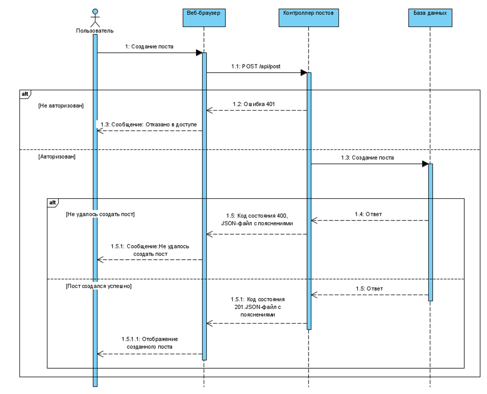

Рисунок 8 – Диаграмма последовательности для процесса создания поста

На рисунке 9 изображена диаграмма, описывающая взаимодействие систем и других компонентов разрабатываемого веб-приложения через интерфейсы.

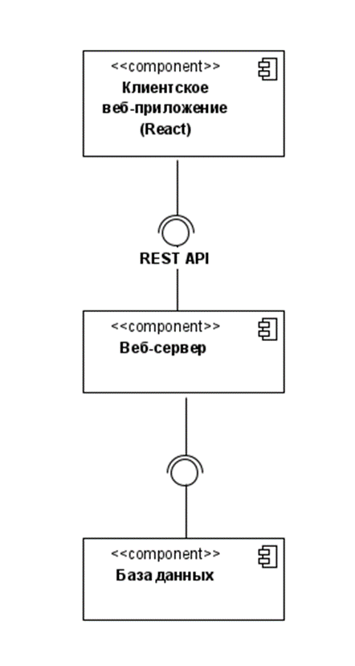

## 2.4. Информационное обеспечение

Хранение информации в системе производится базой данных (для хранения данных тем, тредов и постов, данных о пользователях и т.д.) и файлами (для организации и хранения медиафайлов).

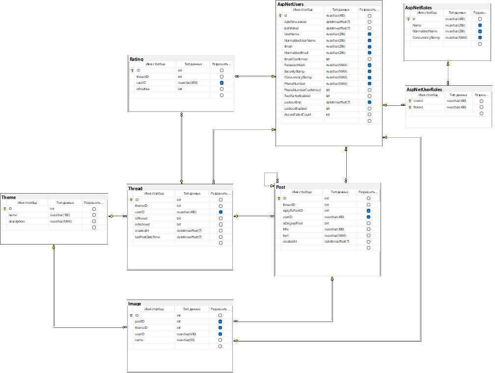

Рисунок 10 – Физическая модель БД

Файлы хранятся в одной директории Images в файловом хранилище сервера, на котором работает приложение WebApi.

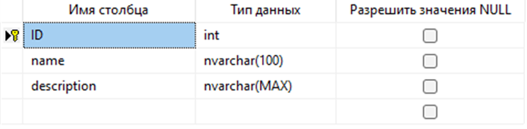

Рисунок 11 – Таблица Theme

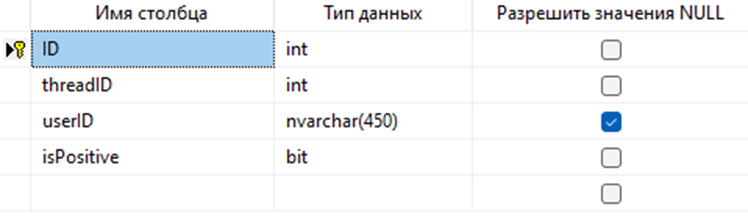

Рисунок 12 – Таблица Rating

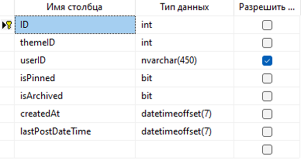

Рисунок 13 – Таблица Thread

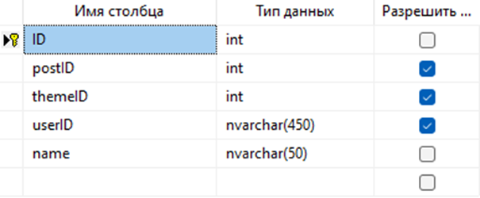

Рисунок 14 – Таблица Image

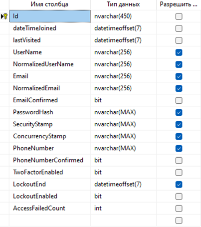

Рисунок 15 – Таблица AspNetUsers

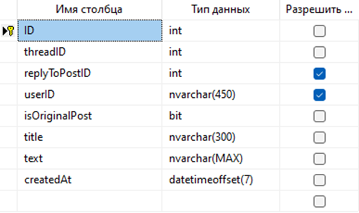

Рисунок 16 – Таблица Post

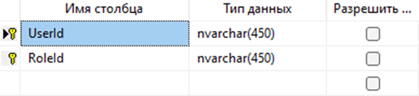

Рисунок 17 – Таблица AspNetUserRoles

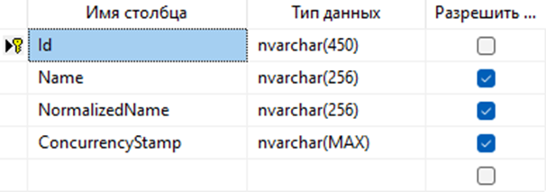

Рисунок 18 – Таблица AspNetRoles

## 2.5. Проект пользовательского интерфейса

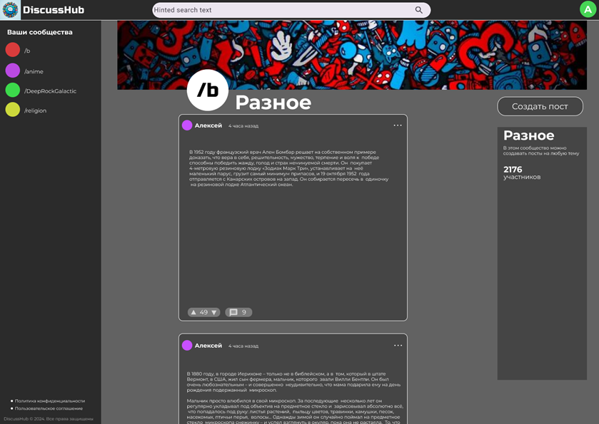

Рисунок 19 – Макет интерфейса одного из разделов сайта, выполненный с помощью инструмента проектирования интерфейсов Figma

## 2.6. Архитектурный шаблон

Были использованы следующие архитектурные шаблон разделения приложения на две части: клиентскую часть и серверную часть.

## 2.7. Техническое обеспечение

**Требования к серверу:**

-	Не менее 4 Гб оперативной памяти; 
-	10 Гб дискового пространства;
-	Процессор с тактовой частотой не менее 2 ГГц.

**Требования к клиенту:**

-	Операционная система, на которой можно запустить веб-браузер
-	Современный веб-браузер (Chrome, Safari, Firefox, Opera и т.д.)
-	Минимальный объем оперативной памяти не менее 500 Мб;  
-	Свободное дисковое пространство не менее 4 096 байт (максимальный размер Cookie);  
-	Процессор с тактовой частотой не менее 1,5 ГГц. 

# 3. Конструирование

## 3.1. Обоснование выбора языка реализации и среды программирования

Для реализации серверной части проекта был выбраны язык C#, так как курс обучения в университете дал обширные практические и теоретические знания об этом языке программирования.

Для реализации клиентской части используется JavaScript, ввиду его популярности и принятии в среде разработчиков.

Выбранные среды разработки для серверной части: Visual Studio 2022 и JetBrains Rider 2024.1. Обе среды представляют собой интегрированные среды разработки, обладающие широким спектром инструментов для создания различных типов приложений, включая веб-приложения. Это включает в себя редактор кода, отладчик, профилировщик, дизайнер интерфейса и другие функции, обеспечивающие комфортную и эффективную работу разработчиков. Первая среда использовалась на начальном этапе разработки. Потом разработка перешла на использование в основном Rider из-за приятного пользовательского интерфейса и удобной интеграцией с дополнением Codeium.	Для клиентской части выбрана среда разработки VS Code. Это самое популярное решение. К нему были установлены плагины для удобной разработки: Babel JavaScript, ESLint, Prettier. 

## 3.2. Организация файлового хранилища для исходных кодов, исполняемых файлов, внешних компонентов, наборов данных

Проект состоит из двух частей. Первая отвечает за серверную часть, а вторая за клиентскую. Файлы этих двух приложений хранятся в двух директориях: backend и frontend.

Серверное приложение представляет из себя ASP.NET Core Web API. В директории backend находятся директории: .idea (файлы конфигурации Rider), .vs (файлы конфигурации Visual Studio), WebAPI (директория с файлами проекта, исходным кодом), а также файл DiscussHub.sln, который используется для управления проектами (в данном случае проект только один - WebAPI). В директории backend есть поддиректории с файлами исходного кода и файлы: 

Таблица 19 – Поддиректории в директории проекта WebAPI

| Директория / Файл      | Содержание                                                                                   |
|------------------------|---------------------------------------------------------------------------------------------|
| Context                | Содержит файл контекста данных. Содержит наборы объектов классов моделей и их связи.        |
| Controllers            | Содержит контроллеры.                                                                       |
| Data                   | Содержит файлы, инициализирующие базу данных.                                              |
| Models                 | Содержит модели сущностей.                                                                 |
| Properties             | Содержит файл `launchSettings.json`, описывающий конфигурации запуска, такие, как порт, использование веб-сервера. |
| ViewModel              | Содержит файлы моделей, использующихся при регистрации, идентификации и аутентификации.    |
| appsettings.json       | Содержит настройки приложения, строку подключения к базе данных, настройки логгирования, допустимые хосты. |

Клиентское приложение представляет из себя React-приложение. Директория клиентской части frontend содержит:

Таблица 20 – Содержание директории frontend

| Директория / Файл      | Содержание                                                                                              |
|------------------------|--------------------------------------------------------------------------------------------------------|
| build                  | Содержит результат сборки React-приложения в статические файлы HTML, CSS и JS.                        |
| node_modules           | Содержит модули Node.js, используемые при разработке.                                                 |
| public                 | Содержит статические файлы, которые доступны напрямую из браузера без обработки сервером.             |
| src                    | Содержит исходный код веб-приложения.                                                                 |
|                        | **Поддиректории и файлы:**                                                                            |
|                        | - **api**: Содержит код сервисов, в которых описаны методы обращения к WebAPI.                        |
|                        | - **components**: Содержит React-компоненты.                                                         |
|                        | - **App.js**: Главный React-компонент.                                                               |
|                        | - **config.js**: Содержит маршрут, по которому нужно обращаться к WebAPI.                             |
|                        | - **index.js**: Точка входа в React-приложение, создающий корневой контейнер.                         |
| package.json           | Файл конфигурации Node.js проекта (используется пакетный менеджер npm). Содержит настройки и зависимости проекта. |

## 3.3. Выбор стиля кодирования

При выборе стиля написания кода на C# были выбраны правила с официального сайта Microsoft Code-Style rules (https://learn.microsoft.com/en-us/dotnet/fundamentals/code-analysis/style-rules).

Для языка JavaScript использовались рекомендации Google JavaScript Style Guide (https://google.github.io/styleguide/jsguide.html).

## 3.4. Способы поддержки версий файлов и сборок в процессе разработки

Система контроля версий, выбранная для этого проекта - Git. Это самый знакомый и популярный вариант, имеющий большую документацию и сообщество, которое способно помочь в правильной организации проектов и при возникающих трудностях.

Удаленный репозиторий проекта распологается на платформе GitHub в приватном репозитории. Решение выбора именно этого варианта обусловлено знакомством с этой средой, удобством использования, возможностью создать приватный репозиторий.

## 3.5. Описание способа включения в проект новых программистов при его последующем развитии или коммерциализации

Возможно включение в проект новых программистов при помощи предоставления им доступа к приватному репозиторию.

Команду разработки можно разбить на две команды, одна из которых бы занималась разработкой клиентской части, а другая – серверной. При этом будет необходимо согласовывать интерфейс, предоставляемый серверным приложением.

Теоретическая коммерциализация проекта может быть реализована с помощью встроенной на сайт рекламы.

# 4. Тестирование и отладка

## 4.1. Модульное тестирование

Было решено провести модульное тестирование контроллера постов (PostController). Для проведения модульного тестирования использовался фреймворк модульного тестирования xUnit.net. Данный фреймворк предоставляет несложный API, который позволяет быстро написать и автоматически проверить тесты. Тестирование проводилось в среде разработки JetBrains Rider. Код тестов представлен в приложении А.

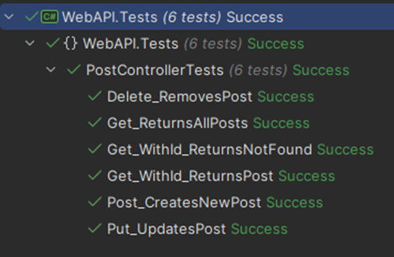

Рисунок 20 – Результаты модульного тестирования

Таблица 21 – Описание тестов

| Название теста                  | Назначение теста                                                                                   |
|---------------------------------|-----------------------------------------------------------------------------------------------------|
| Get_ReturnsAllPosts             | Проверяет, что метод `Get` возвращает все посты.                                                   |
| Get_WithId_ReturnsPost          | Проверяет, что метод `Get` с параметром `id` возвращает соответствующий пост.                      |
| Get_WithId_ReturnsNotFound      | Проверяет, что метод `Get` с несуществующим `id` возвращает `NotFound`.                            |
| Post_CreatesNewPost             | Проверяет, что метод `Post` создает новый пост и возвращает `CreatedAtAction`.                     |
| Put_UpdatesPost                 | Проверяет, что метод `Put` обновляет существующий пост и возвращает `Ok`.                          |
| Delete_RemovesPost              | Проверяет, что метод `Delete` удаляет пост и возвращает `Ok`, а также что пост действительно удален из базы данных. |

## 4.2. Функциональное тестирование

Функциональное тестирование проводилось с использованием классов эквивалентности. Это самый популярные метод функционального тестирования.

Таблица 22 – Классы эквивалентности

| События и действия             | Допустимые классы эквивалентности                                                                          | Недопустимые классы эквивалентности                                                                                   |
|--------------------------------|-----------------------------------------------------------------------------------------------------------|-----------------------------------------------------------------------------------------------------------------------|
| Регистрация                    | Уникальные непустые почта и логин, проходящие валидацию, два совпадающих непустых пароля, которые содержат хотя бы одну цифру и специальный символ | Занятые почты и логин. Пустые почта, логин или пароль. Пароль слишком короткий или не содержит хотя бы одну цифру и специальный символ |
| Вход                           | Корректные существующие непустые логин и пароль. Пароль привязан к данному логину                         | Пустые логин или пароль. Несуществующие логин или пароль. Пароль не связан с данным логином                           |
| Поставить лайк треду           | Пользователь авторизован и имеет по крайней мере роль «user»                                              | Пользователь не авторизован                                                                                           |
| Поставить дизлайк треду        | Пользователь авторизован и имеет роль «user», «moderator» или «administrator»                             | Пользователь не авторизован                                                                                           |
| Создать, изменить или удалить тему | Пользователь авторизован и имеет роль «administrator»                                                   | Пользователь не авторизован                                                                                           |
| Создать тред                   | Пользователь авторизован и имеет роль «user», «moderator» или «administrator»                             | Пользователь не авторизован                                                                                           |
| Изменить или удалить тред      | Пользователь авторизован и имеет роль «moderator» или «administrator»                                     | Пользователь не авторизован                                                                                           |
| Создать пост                   | Пользователь авторизован и имеет роль «user», «moderator» или «administrator»                             | Пользователь не авторизован                                                                                           |
| Изменить или удалить пост      | Пользователь авторизован и имеет роль «moderator» или «administrator»                                     | Пользователь не авторизован                                                                                           |

## 4.3. Тестирование пользовательского интерфейса

Тестирование пользовательского интерфейса проводилось методом мысли вслух. Были созданы сценарии тестирования, которые были выполнены, а их результат сравнен с ожидаемым поведением.

Таблица 23 – Сценарий регистрации и входа

| Шаг тестирования                                                                                            | Ожидаемый результат                                                  |
|-------------------------------------------------------------------------------------------------------------|----------------------------------------------------------------------|
| Открытие сайта                                                                                              | Открывается главная страница с меню, в котором есть пункт «Регистрация» |
| Нажатие на кнопку «Регистрация»                                                                             | Открывается страница регистрации нового пользователя                 |
| Пользователь ввел корректные данные для регистрации (непустые уникальные логин, электронную почту, два совпадающих пароля) | Появляется надпись, что регистрация прошла успешно                    |
| Нажатие на кнопку «Вход» в главном меню                                                                     | Открывается страница входа с предложением ввести логин и пароль       |
| Вход в систему: введение верных данных для входа (логина и пароля) и нажатие на кнопку «Войти»              | Отображается надпись, что пользователь успешно вошел в систему        |

# 5. Ввод в эксплуатацию

Таблица 24 – Сценарий того, как пользователь отмечает лайком понравившийся тред

| Шаг тестирования                                                    | Ожидаемый результат                                                |
|---------------------------------------------------------------------|--------------------------------------------------------------------|
| Открытие сайта                                                      | Открывается главная страница, на которой есть меню с пунктом «Войти» |
| Нажатие на кнопку «Вход»                                            | Открывается страница входа в систему                               |
| Вход в систему: введение верных данных для входа (логина и пароля) и нажатие на кнопку «Войти» | Отображается надпись, что пользователь успешно вошел в систему     |
| Открытие какой-нибудь темы сайта, например, Random                  | Открывается страница сайта с выбранной темой, отображаются треды темы |
| Нажатие на кнопку «Нравится» у какого-нибудь треда                  | Счетчик лайков увеличивается на 1 у выбранного треда               |

Таблица 25 – Сценарий редактирования темы

| Шаг тестирования                                                                                                | Ожидаемый результат                                                                                     |
|-----------------------------------------------------------------------------------------------------------------|---------------------------------------------------------------------------------------------------------|
| Открытие сайта                                                                                                  | Открывается главная страница                                                                            |
| Вход в систему под учетной записью администратора: введение верных данных для входа (логина и пароля) и нажатие на кнопку «Войти» | Отображается надпись, что пользователь успешно вошел в систему. Отображается роль пользователя «admin»  |
| Нажатие на кнопку редактирования темы «✏️» в списке слева страницы                                              | Открывается модальное окно редактирования темы                                                          |
| Редактирование данных темы в модальном окне, нажатие на кнопку «Сохранить»                                      | Отображение внесенных изменений в списке тем                                                            |

Таблица 26 – Создание поста

| Шаг тестирования                                                                                          | Ожидаемый результат                                        |
|-----------------------------------------------------------------------------------------------------------|------------------------------------------------------------|
| Открытие сайта                                                                                            | Открывается главная страница                               |
| Вход в систему: введение верных данных для входа (логина и пароля) и нажатие на кнопку «Войти»            | Отображается надпись, что пользователь успешно вошел в систему |
| Открытие какой-нибудь темы сайта, например, Random: нажатие на нужную тему в левой части страницы         | Открывается страница сайта с выбранной темой, отображаются треды темы |
| Открытие какого-нибудь треда: нажатие на карточку треда в основной части страницы                         | Открывается страница треда. На ней отображаются посты данного треда |
| Ввод данных поста в форму создания нового поста. Нажатие на кнопку «Создать пост»                         | Отображение нового поста в списке постов                    |

## 5.1. Развертывание

1) Клонировать git-репозиторий

2) Развертывание серверной части на IIS на Windows
   1. Установить .NET Core SDK (https://learn.microsoft.com/en-us/dotnet/core/sdk
   2.	Установить пакет хостинга .NET Core (https://dotnet.microsoft.com/permalink/dotnetcore-current-windows-runtime-bundle-installer) на сервер IIS. Пакет устанавливает среду выполнения .NET Core, библиотеку .NET Core и модуль ASP.NET Core. Модуль позволяет приложениям ASP.NET Core работать за IIS.
        - (a)	Запустить установщик
        - (b)	Перезапустить сервер, выполнив в терминале команду net stop was /y, а затем команду net start w3svc.
    3.	Упаковать приложение ASP.NET Core в виде самодостаточного исполняемого файла в среде Visual Studio 2022 или Rider
        - (a)	Собрать приложение в режиме Release
        - (b)	Кликнуть правой кнопкой мыши по проекту WebAPI и нажать «Publish» («Опубликовать»). Выбрать «Release» для публикации. Опубликовать.
        - (c)	Скопировать полученную директорию publish в удобное место
    4.	В IIS manager создать создать сайт. Прописать путь до директории publish
3)	Развертывание клиентской части
    1.	Заменить URL, использовавшийся при разработке на URL сервера IIS
    2.	Собрать клиентскую часть приложения с помощью команды npm run build
    3.	Настройка приложения ASP.NET Core: В приложении ASP.NET Core, нужно убедиться, что настроены статические файлы и путь к собранным файлам React.
    4.	Так как приложение использует react-router, то еще нужно настроить перенаправление URL в IIS, чтобы все запросы были направлены на index.html

## 5.2. Руководство пользователя

### 5.2.1. Основное

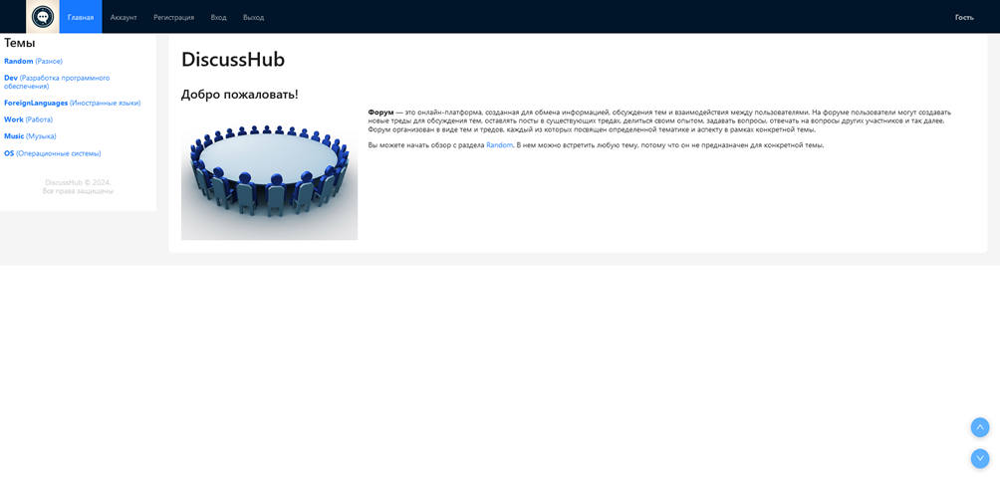

Рисунок 21 – Главная страница

На главной странице есть верхнее меню, содержащее несколько пунктов: Главная, Регистрация, Вход, Выход. Они представляют собой страницы с соответствующей логикой. В правом верхнем углу отображается имя и роль вошедшего пользователя.

Слева есть колонка, содержащая темы, которые имеются на форуме. На них можно перейти, щелкнув мышкой по нужной ссылке.

В приложении предусмотрено три роли пользователей: user (зарегистрированный пользователь; может создавать треды и посты), moderator (модератор; может модерировать контент, блокировать пользователей) и admin (администратор; может настраивать список тем, управлять списком пользователей, назначать пользователей модераторами). Приложением может пользоваться и не зарегистрированный пользователь. Его возможности ограничены чтением тредов и постов, создавать он их не может.

### 5.2.2. Регистрация

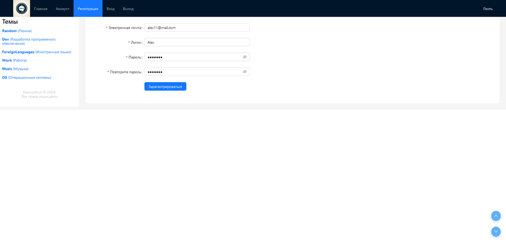

Рисунок 22 – Регистрация

Чтобы зарегистрироваться нужно на странице регистрации ввести электронную почту, логин и пароль, затем нажать на кнопку «Зарегистрироваться». Почта и логин должны быть уникальными.

### 5.2.3. Вход

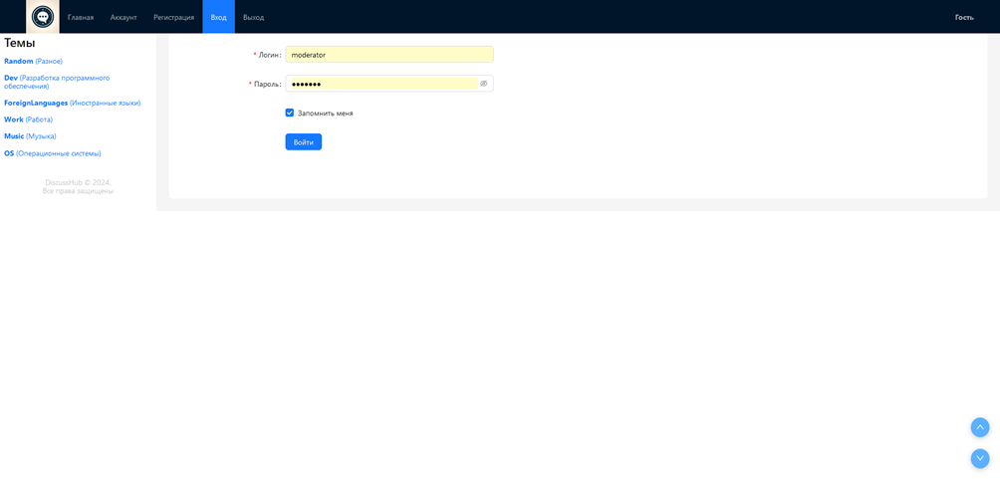

Рисунок 23 – Вход

Чтобы войти в учетную запись нужно на странице входа ввести почту и пароль и нажать «Войти»

### 5.2.4. Выход

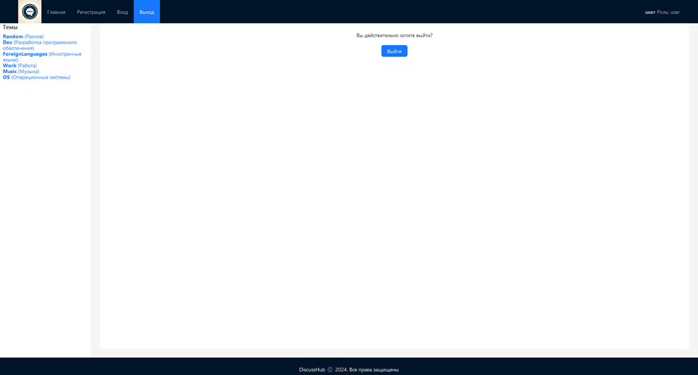

Чтобы выйти, нужно нажать на кнопку «Выйти» на странице выхода

Рисунок 24 – Выход

### 5.2.5. Изменение данных аккаунта (почты или пароля)

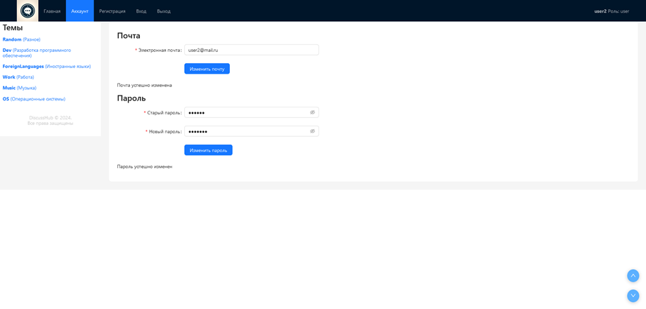

Рисунок 25 – Выход

### 5.2.6. Треды

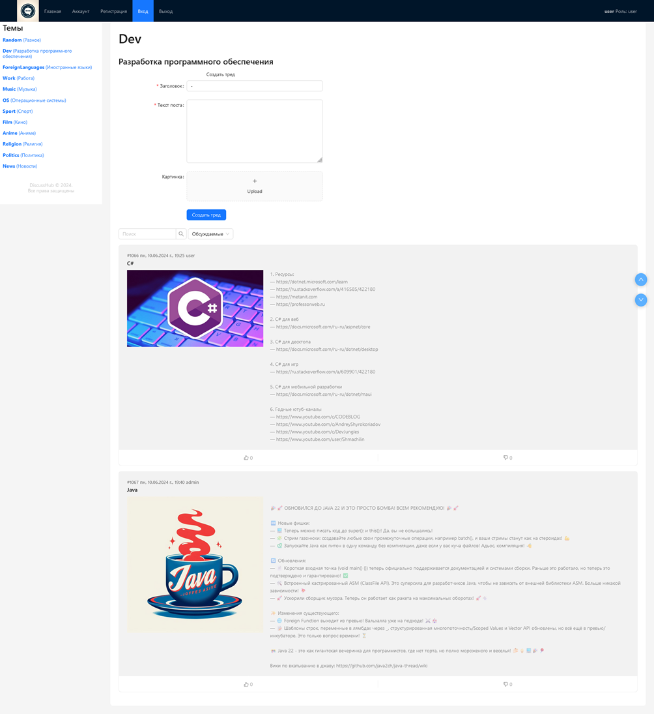

Рисунок 26 – Треды

Чтобы зайти в тему и посмотреть треды, нужно нажать на название нужной темы в левой колонке. Появляется список тредов. Можно создать новый тред. Для этого есть специальная форма внизу страницы. Нужно ввести заголовок нового треда, его текст, можно прикрепить изображение.

Чтобы зайти в тред нужно кликнуть по номеру нужного треда.

### 5.2.7. Посты

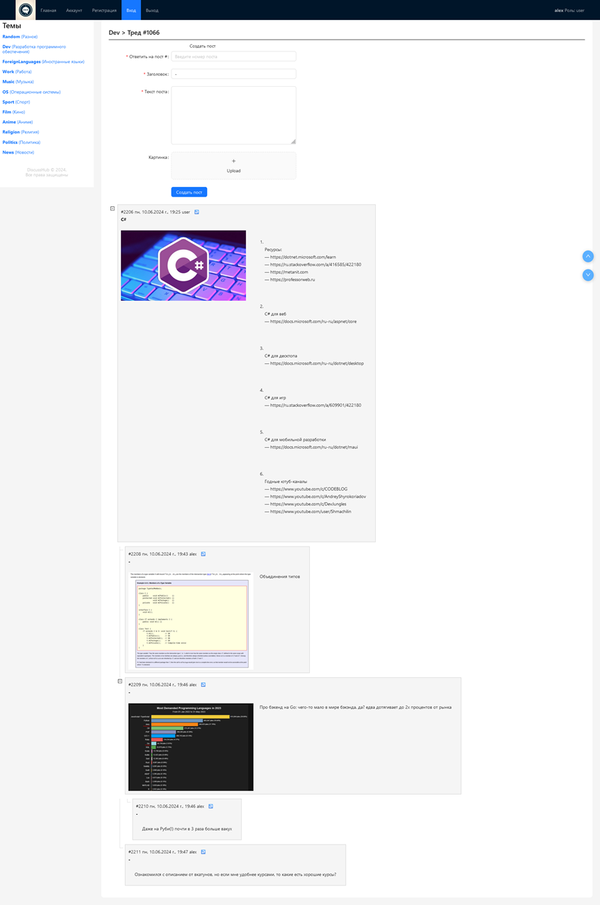

Рисунок 27 – Посты

Чтобы посмотреть комментарии к треду, нужно, как уже сказано, кликнуть по номеру треда. Откроется список постов треда. Здесь можно создать новый пост, аналогично созданию треда. Особенностью создания поста является то, что можно создать пост как ответ на другой пост. Для этого нужно ввести номер поста, на который нужно ответить в соответствующее поле или нажать на кнопку «Ответить» рядом с постом. Также можно быстро перемещаться к нужному посту нажимая на номера постов в разделах «Ответы».

### 5.2.8. Оценка тредов

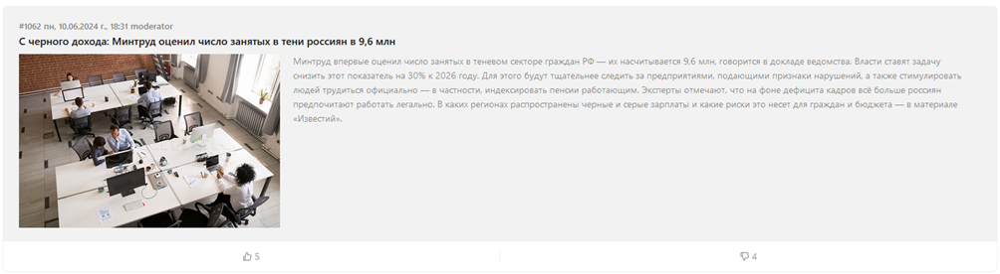

Рисунок 28 – Оценка тредов

Чтобы оценить тред, нужно для начала войти в систему со своего аккаунта. Далее, пользователю нужно перейти в какую-нибудь тему и с помощью нажатия на значки «👍» и «👎» под тредом поставить ему лайк или дизлайк.

### 5.2.9. Поиск по тредам

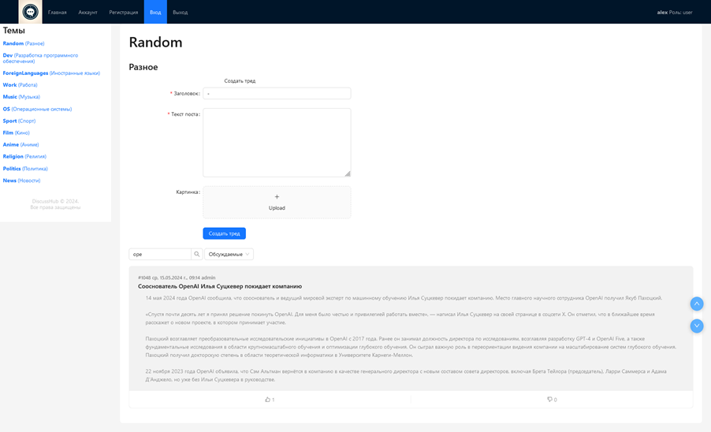

Рисунок 29 – Поиск по тредам

Вверху списка тредов в любой теме есть поле для поиска. Чтобы искать, нужно просто ввести текст. Поиск осуществляется по заголовкам и тексту главного поста треда.

### 5.2.10. Функции, доступные модератору

Модератор может удалять треды и посты, нажимая на кнопку «❌».

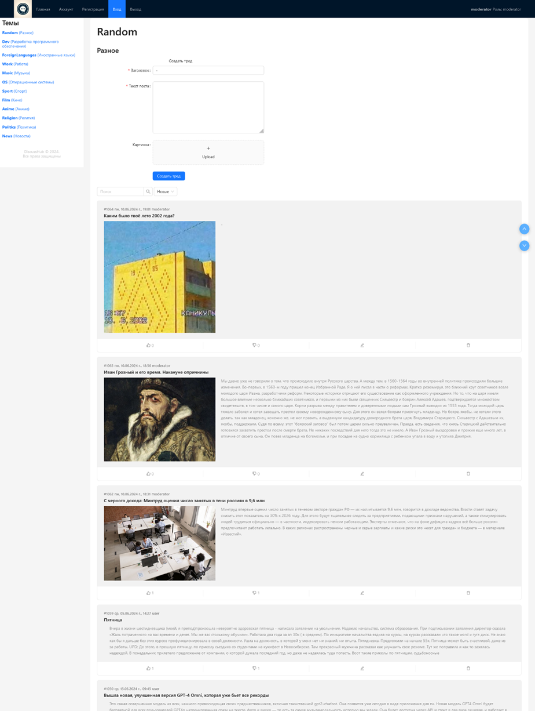

Рисунок 30 – Как видит список тредов модератор

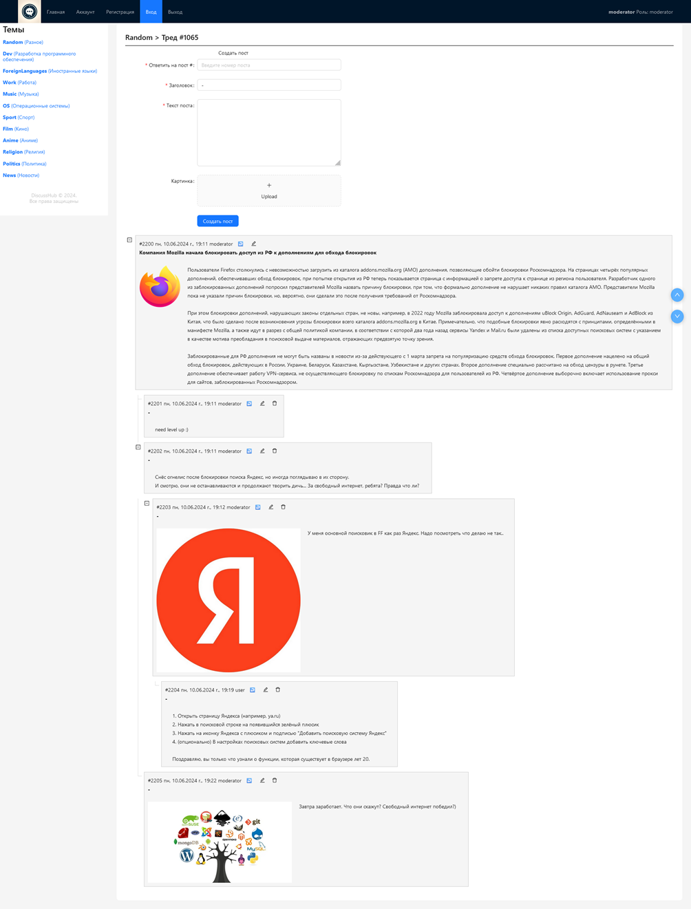

Рисунок 31 – Как видит список постов модератор

### 5.2.11. Функции, доступные администратору

Администратор может редактировать список тем. Чтобы удалить тему он нажимает на кнопку «❌». Чтобы добавить тему он вводит ее название и описание и нажимает на кнопку «Создать тему»

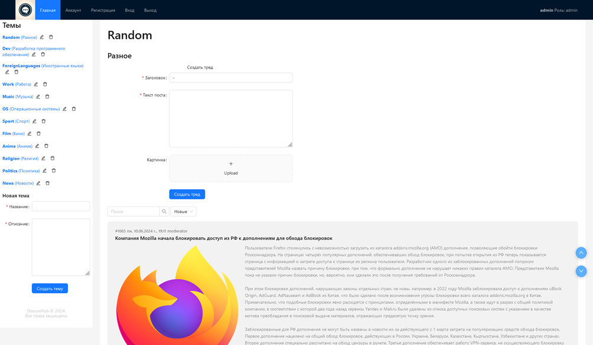

Рисунок 32 – Как видит список тем администратор

# Заключение

В ходе работы были проведены этапы по разработке веб-приложения форума, позволяющего пользователям общаться между собой, создавать ветки для обсуждения своих тем. Возможность выразить свои мысли гармонично дополняется возможностью прикреплять к постам изображения.

Были выполнены следующие поставленные задачи по реализации функционала:

-	Управление темами, тредами и постами
-	Возможность прикрепления изображения к посту
-	Идентификация, аутентификация и авторизация пользователей с несколькими ролям пользователей и разграничением их прав
-	Система оценки тредов
-	Удобная навигация по веб-приложению

В дальнейшем получившееся приложение можно развить и добавить новый функционал. Есть следующие идеи:

-	Администрирование пользователей
-	Функционал личных сообщений
-	Возможность пожертвования средств создателю треда посредством криптовалюты, чтобы поощрять пользователей создавать качественный контент для сайта
-	Проверка фактов, изложенных в посту с помощью большой языковой модели

# Список использованной литературы

1. Левенец И.А. Разработка и анализ требований: Учеб. пособие / ФГБОУВПО «Ивановский государственный энергетический университет имени В. И. Ленина». – Иваново, 2014. – 80 с. 
2. ГОСТ 7.32-2017 ССИБИД. Отчёт о научно-исследовательской работе. Структура и правила оформления. - М.: Стандартинформ, 2017. – 32 с. 
3. ASP.NET Core [Электронный ресурс] . – Режим доступа: https://docs.microsoft.com/ru-ru/aspnet/core/ (дата обращения: 14.05.2024)
4. Publish an ASP.NET Core app to IIS [Электронный ресурс]. – Режим доступа: https://learn.microsoft.com/en-us/aspnet/core/tutorials/publish-to-iis?view=aspnetcore-8.0&tabs=visual-studio (дата обращения: 14.05.2024)
5. Документация по C# [Электронный ресурс] – Режим доступа: https://docs.microsoft.com/ru-ru/dotnet/csharp/  (дата обращения: 14.05.2024)
6. Metanit [Электронный ресурс] – Режим доступа: https://metanit.com/ (дата обращения: 14.05.2024)
7. Create React App [Электронный ресурс] – Режим доступа: https://create-react-app.dev/ (дата обращения: 14.05.2024)
8. React. Quick Start [Электронный ресурс] – Режим доступа: https://react.dev/learn#conditional-rendering (дата обращения: 14.05.2024)
9. Современный учебник JavaScript [Электронный ресурс] – Режим доступа: https://learn.javascript.ru/ (дата обращения: 14.05.2024)
10. Ant Design 5.0 [Электронный ресурс] – Режим доступа: https://ant.design/ (дата обращения: 14.05.2024)

# Приложения

## Приложение Б. Результаты проверки на антиплагиат

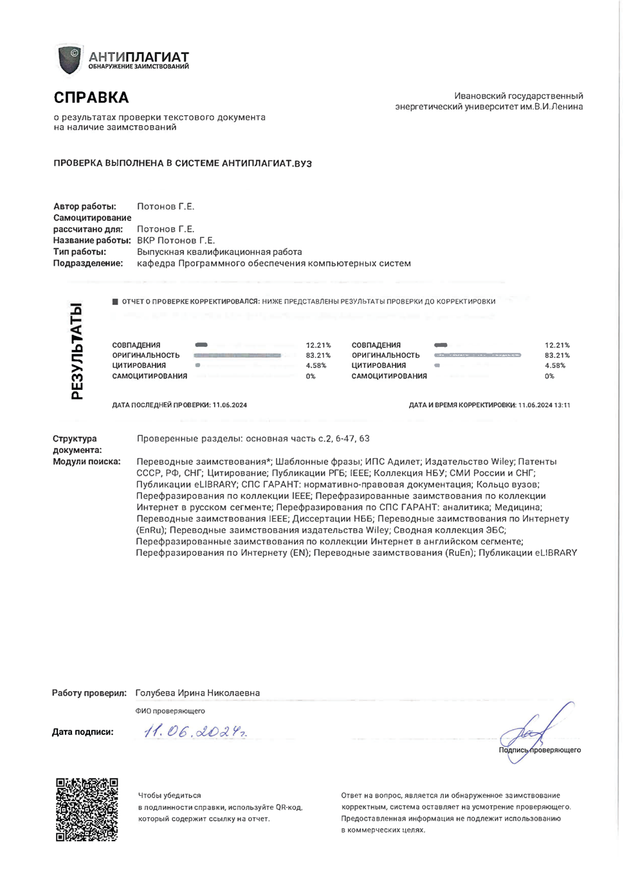

Рисунок 33 – Результат проверки на антиплагиат

